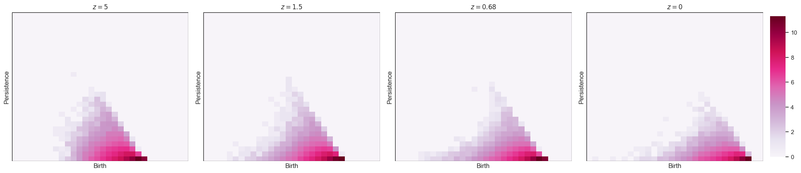
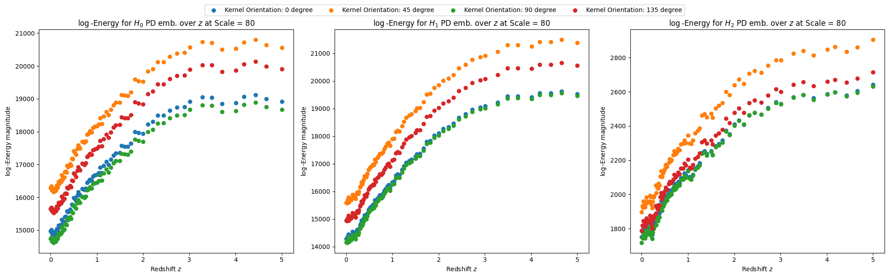

# Hierarchical Clustering in ΛCDM Cosmologies via Persistence Energy
**Author**: Michael Etienne Van Huffel

## Description
This repository hosts the official implementation of the algorithms and analysis techniques featured in the paper [*Hierarchical Clustering in ΛCDM Cosmologies via Persistence Energy*](https://arxiv.org/abs/2401.01988). It includes processing scripts for analyzing cosmic structure formation through topological data analysis and the persistence homology pipeline up to the construction of persistence diagrams.

### Visualizations
The figures below illustrate various aspects of the cosmic structures analyzed in our study, ranging from galaxy distributions to the quantification of their persistence features.

#### Discretized Persistence Diagrams

*Discretized persistence diagrams of H1 homology groups at four different redshift values, illustrating the evolution of topological features.*

#### Log-Persistence Energy Magnitude

*Log energy magnitude values of the Persistent Signals vectorization method across redshift from z=5 to z=0, highlighting the evolution of persistence energy for Gabor functional at scale = 80 in different homology dimensions and hyperparameter settings.*

## Delaunay Tessellation Field Estimator
The Delaunay Tessellation Field Estimator (DTFE) method used to compute the tessellation is taken from the official C++ implementation available [here](https://github.com/MariusCautun/DTFE).


## Installation
To reproduce the analysis environment, you will need Python 3.6 or later. Please install the required Python packages listed in `requirements.txt`.

```bash
git clone git@github.com:majkevh/cosmic-master.git
cd cosmic-master
pip install -r requirements.txt
```

## Usage
Execute the analysis pipeline with the following commands:

```bash
python3 parser.py [options]
bash runner.sh
```

## Data
The data employed in our analysis is sourced from the [IllustrisTNG](https://www.tng-project.org/data/) simulations. Users must ensure they have the necessary permissions to access and utilize this data.

## License
The contents of this project are made available under the terms of the MIT License. For more details, refer to the [LICENSE](LICENSE) file.

## Acknowledgments
We extend our gratitude to the IllustrisTNG project for the simulation datasets that underpin our analysis.
